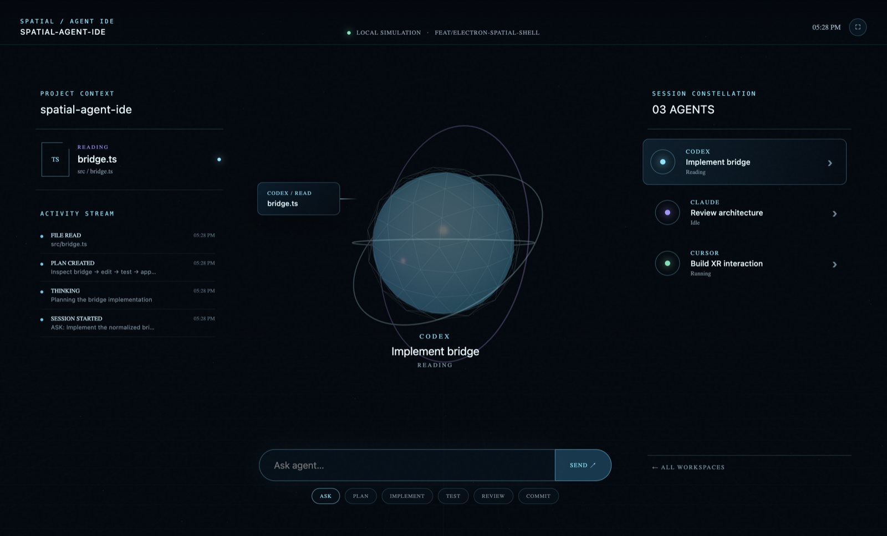
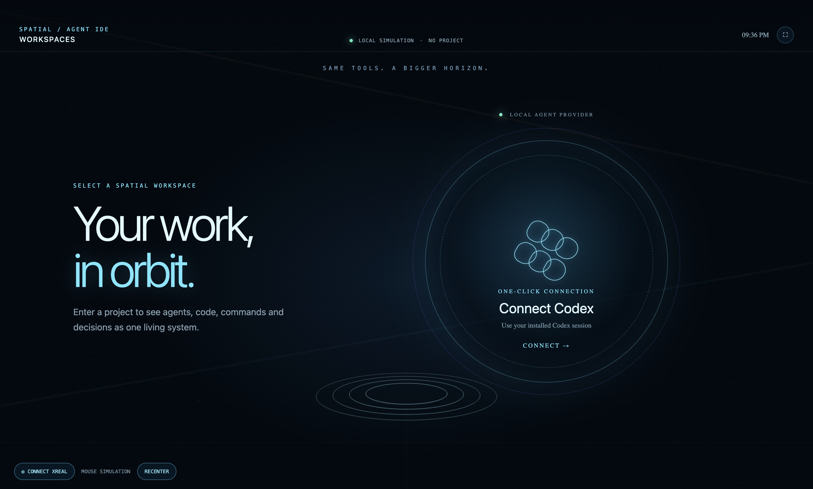
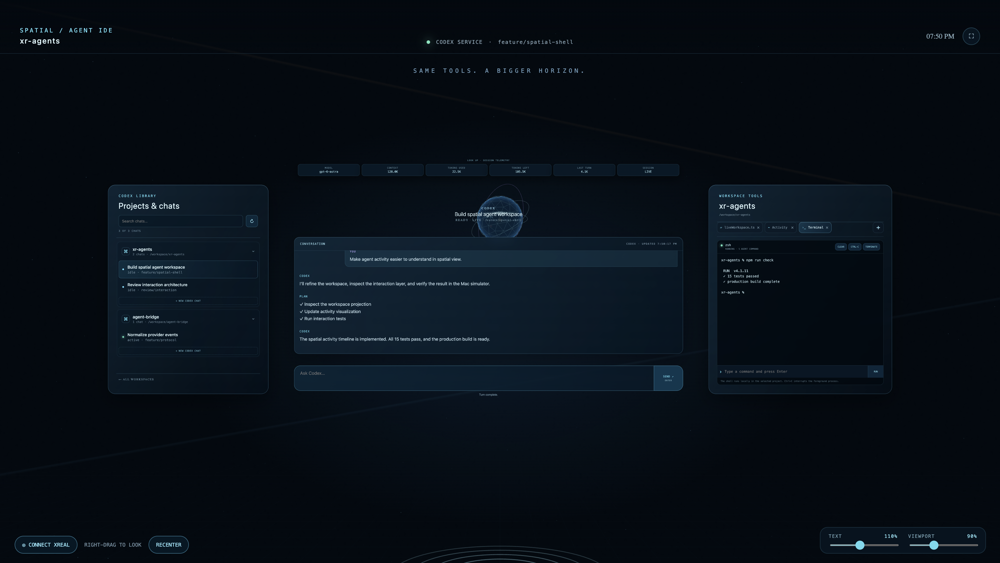

# Spatial Agent IDE

A functional Electron and Three.js proof of concept for a spatial shell for AI-assisted software development. It runs entirely on macOS without XREAL hardware or live agent credentials.

> [!WARNING]
> **Experimental software.** This project is provided as-is, without warranties or guarantees of any kind. You assume full responsibility for installing, configuring, and using it, including any commands executed, files changed, data lost, or effects on connected devices and services.

## Demo

[](media/xr-agents-demo.mov)

Click the image to watch the [23-second spatial workspace demo](media/xr-agents-demo.mov). It uses a clean synthetic Codex session to show connection, project navigation, streamed plans and file activity, approvals, terminal output, token telemetry, and task completion.

| Connect Codex | Spatial workspace |
| --- | --- |
|  |  |

### Full workspace overview

[](media/screenshots/full-ui.png)

## Download for macOS

[Download Spatial Agent IDE 0.5.0 for Apple Silicon](https://github.com/r4dical-admin/xr-agents/releases/download/v0.5.0/Spatial-Agent-IDE-0.5.0-arm64.dmg)

1. Download and open the DMG.
2. Drag **Spatial Agent IDE** into **Applications**.
3. On first launch, Control-click the app and choose **Open**, then confirm **Open**. The current experimental build is unsigned and not notarized, so macOS may otherwise block its first launch.
4. Click **Connect Codex**. The app finds the Codex CLI bundled with Codex.app or ChatGPT.app and uses the existing local Codex login.

This build requires an Apple Silicon Mac. It does not require XREAL hardware; right-drag simulates head movement on the Mac. XREAL sensor support remains experimental.

## What is implemented

- One-click Codex App Server connection with live task creation, resume, prompting, steering, streaming and interruption, plus three provider-neutral mock sessions.
- WebGL agent orb with distinct visual states and restrained motion.
- Materialized READ, EDIT, RUN, TEST and COMPLETE activity objects.
- Read-only source and diff viewer with line numbers and changed-line styling.
- Interactive local pseudo-terminal rooted in the selected project, with streaming output, command input, Ctrl+C, clear, terminate and restart controls.
- Interrupting amber approval card with Allow once, Allow session and Deny paths for live command and file requests.
- Typed normalized workspace/event model and a deterministic 36-second mock provider.
- Horizontally damped head/pointer panning across a workspace wider than the display; working surfaces remain vertically centered so sensor pitch drift cannot pull the IDE down.
- Expanded panoramic side surfaces, a raised central conversation, persistent text/view scale sliders, and an overhead model/context/token/session surface revealed by looking up.
- Three-line wrapped prompt composer with Enter to send and Shift+Enter for a new line.
- Orb-triggered macOS speech synthesis for the latest Codex response.
- Electron isolation: renderer code has no Node.js or filesystem access.

Connect Codex replaces the demo workspace with your actual local Codex tasks. Projects and chats appear in a searchable library on the left. The conversation occupies the center, while files, activity and terminal output share a tabbed inspector on the right. Selecting an idle task resumes it and subscribes to live App Server events. The composer starts a turn or steers the active turn, Stop interrupts it, and command/file approvals are resolved in the spatial interface.

The app first tries `codex app-server proxy`, then falls back to a private App Server using the local task store. It searches both Codex.app and ChatGPT.app for the bundled CLI. App Server permits one active writer per task: a task currently running in Codex remains available as saved history, while idle tasks can be resumed live. Use **New Codex Chat** under a project to create a live task owned by Spatial Agent IDE. Cloud-only ChatGPT conversations are not exposed by this local integration. Tasks with `notLoaded` status are labeled Stored, not Idle. The task query includes appServer, CLI, VS Code, exec and unknown sources, with a Load more button for pagination.

## Run on macOS

Requirements: Node.js 22 or later and npm.

```bash
git clone https://github.com/r4dical-admin/xr-agents.git
cd xr-agents
npm install
npm run dev
```

In the app:

1. Click `Connect Codex`. The app uses the existing local Codex login; there is no API key form.
2. Select a project and chat from the library on the left.
3. Select an idle chat, or click **New Codex Chat** under a project.
4. Send a prompt from the center composer. Live messages, commands, file changes and plans stream into the workspace.
5. Resolve approval cards in the app and use Stop to interrupt a running turn.
6. Open Terminal from the right-side `+` menu. It starts your local shell in the selected project; enter commands at the bottom and use Ctrl-C to interrupt a foreground process.
7. Right-drag to look around without glasses; ordinary mouse movement leaves the view still.

The left and right surfaces are roughly 2.5 times their previous area and intentionally extend beyond the centered display. Look or right-drag toward them to bring each surface into comfortable view. The working surfaces stay vertically centered; look upward to reveal the telemetry surface above the orb. The bottom-right sliders independently change text readability and overall workspace scale, and persist between launches. Click the orb to read the latest Codex response aloud. Token totals and context capacity populate when App Server emits `thread/tokenUsage/updated` during a live turn.

The right surface is a tabbed workbench. Use `+` to open Files, Side chat, Browser, Terminal, or Activity; tabs can be switched and closed like the Codex app. Files shows a task-scoped project tree beside a source preview. It skips internal/dependency/build folders, blocks paths outside the selected project, and truncates previews larger than 256 KB.

If the selected task is already open in Codex, App Server protects it with an active-writer lock. Submitting from Spatial Agent IDE automatically creates a new live chat in the same project and sends the prompt there; the original task remains unchanged.

The mock clock pauses indefinitely at the approval. Denying uses the simulated in-memory transport and still completes the scenario. `Cmd+F` or the top-right button toggles fullscreen.

## Checks and packaging

```bash
npm run check
npm run dist:mac
```

To reproduce the demo recording on macOS:

```bash
npm run demo:capture
```

The capture command builds the app, records a deterministic 1920×1080 frame sequence through the live workspace renderer, and encodes `media/xr-agents-demo.mov` with AVFoundation.

`npm run check` runs behavioral tests and creates production renderer/Electron builds. `npm run dist:mac` creates unsigned macOS `.dmg` and `.zip` artifacts in `dist/`. Public distribution will require an Apple Developer ID certificate and notarization.

Container verification remains available:

```bash
./tools/check-container.sh
```

The graphical Electron application runs natively on macOS. The container performs reproducible TypeScript tests and production compilation.

## Structure

- `src/` — Three.js spatial renderer, DOM interaction layer, normalized models and mock provider.
- `electron/` — isolated desktop main process and minimal preload API.
- `bridge/` — provider-neutral Mac bridge boundary reserved for Milestone 2.
- `protocol/schemas/` — normalized protocol schema.
- `docs/` — architecture, protocol and spatial UX documentation.
- `tests/` — mock workflow behavior tests.
- `archive/unity-milestone-1/` — preserved previous Unity implementation and checks.

Experimental One Pro 3DoF sensor input is implemented. See [head tracking setup](docs/head-tracking.md). Click CONNECT XREAL, hold still for calibration, then RECENTER. Physical hardware validation is pending. Codex live interaction is connected; Claude, Cursor and general bridge filesystem integrations remain unimplemented.
